# 参考
https://github.com/sangyc10/CUDA-code
https://www.bilibili.com/video/BV1sM4y1x7of/

        GPU: 数据运算
        CPU: 逻辑运算

        GPU性能指标: 核心数、GPU显存容量、GPU计算峰值、显存带宽

# cpu + gpu异构架构
        gpu不能单独计算，cpu+gpu组成异构计算架构
        cpu起到控制作用，一般称为主机(host);
        gpu可以看作cpu的协处理器，一般称为设备(device)
        主机和设备之前内存访问一般通过PCIe总线链接
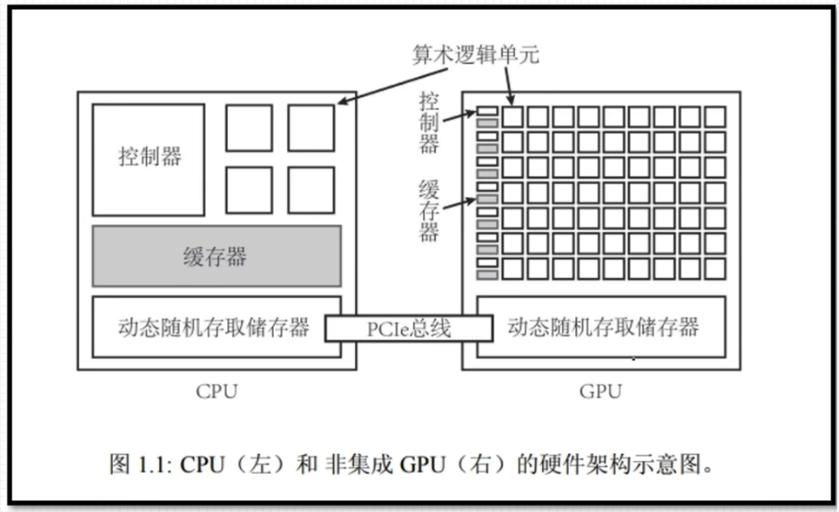

# cuda编程语言
        2006年，英伟达发布cuda
        cuda旨在支持各种语言和应用程序编程接口
        最初基于c语言，目前越来越多支持c++
        cuda还支持pyton编写
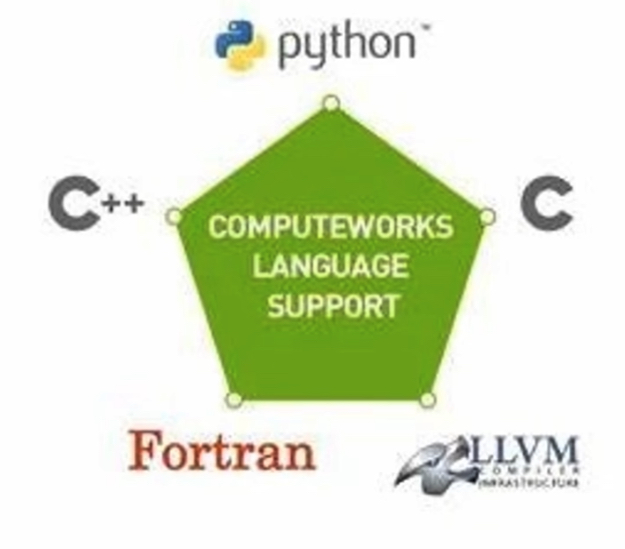

# cuda运行时api
        cuda提供两层api接口，cuda驱动(driver)api和cuda运行时(runtime)api
        两种api调用性能几乎无差异，课程使用操作对用户更加友好的runtime api
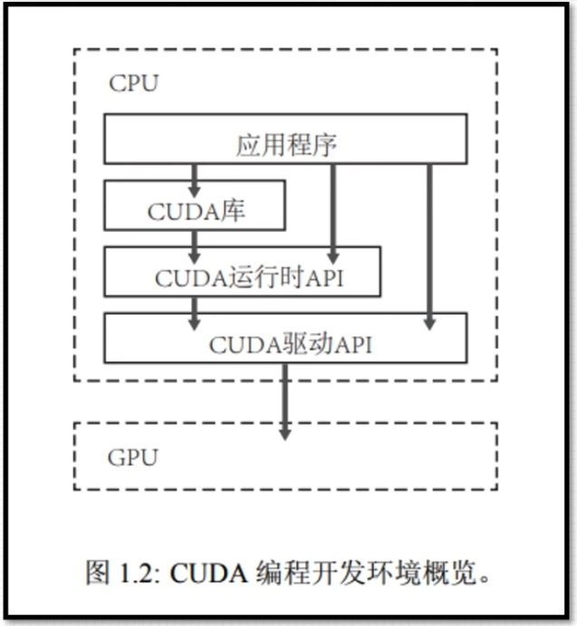

# 相关命令
## NVCC -V是什么？
        NVCC -V是NVIDIA Cuda Compiler的版本检查命令，主要用于显示当前系统上安装的CUDA版本和编译器版本。该命令可以帮助CUDA开发者确认所使用的软件是否是最新版本，以保证程序的性能和稳定性。
        显示一下信息:
        1、NVIDIA Cuda编译器驱动程序的名称：nvcc
        2、NVIDIA Corporation的版权信息
        3、编译器的编译时间：Built on...
        4、CUDA编译工具的版本号：Cuda compilation tools, release...
        5、CUDA编译工具编译时使用的版本号：Build cuda_...
## nvidia-smi
        nvidia-smi（NVIDIA System Management Interface）是一种命令行实用程序，用于监控和管理 NVIDIA GPU（图形处理器）的状态和性能。它提供了一种简单而强大的方式来获取有关 GPU 的实时信息，并且可以用于诊断、优化和管理 GPU 资源。
        信息如下:
                1、GPU：本机中的GPU编号，从0开始，上图为0，1，2，3四块GPU
                2、Fan：风扇转速（0%-100%），N/A表示没有风扇
                3、Name：GPU名字/类型，上图四块均为NVIDIA GeForce RTX 3080
                4、Temp：GPU温度（GPU温度过高会导致GPU频率下降）
                5、Perf：性能状态，从P0（最大性能）到P12（最小性能），上图均为P2
                6、Pwr：Usager/Cap：GPU功耗，Usage表示用了多少，Cap表示总共多少
                7、Persistence-M：持续模式状态，持续模式耗能大，但在新的GPU应用启动时花费时间更少，上图均为On
                8、Bus-Id：GPU总线
                9、Disp.A：Display Active，表示GPU是否初始化
                10、Memory-Usage：显存使用率
                11、Volatile GPU-UTil：GPU使用率，与显存使用率的区别可参考显存与GPU
                12、Uncorr. ECC：是否开启错误检查和纠错技术，0/DISABLED，1/ENABLED，上图均为N/A
                13、Compute M：计算模式，0/DEFAULT，1/EXCLUSIVE_PROCESS，2/PROHIBITED，上图均为Default
                14、Processes：显示每个进程占用的显存使用率、进程号、占用的哪个GPU
        其他命令：
                1、查看gpu详细信息：nvidia-smi -q
                2、查询特定gpu详细信息：nvidia-smi -q -i 0
                3、显示gpu特定信息：nvidia-smi -q -i 0 -d MEMORY
                4、帮助命令：nvidia-smi -h
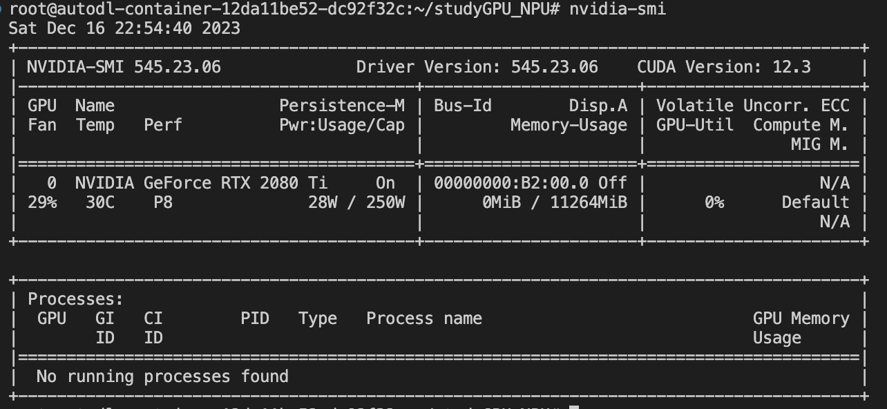

# nvcc编译命令
        nvcc test.cu -o demo
# 核函数
        1、核函数在GPU上进行并行执行, 主机对设备的调用通过核函数
        2、注意：
                2.1、限定词__global__; 
                2.2、返回值必须为void
        3、形式：
                3.1、
                __global__ void kernel_function(argument arg)
                {
                        printf("hello world from the GPU\n")
                }
                3.2、
                void __global__ kernel_function(argument arg)
                {
                        printf("hello world from the GPU\n")
                }
        注意事项：
                1、核函数只能访问GPU内存
                2、核函数不能使用变长参数
                3、核函数不能使用全局变量
                4、核函数不能使用函数指针
                5、核函数具有异步性
## cuda程序编写流程
        int main(void)
        {
                主机代码
                核函数调用
                主机代码
                return 0;
        }

# cuda线程模型
## 线程模型结构
### 一维
        一、线程模型重要概念
                1、grid 网络
                2、block 线程块
                一个Kernel函数对应一个Grid。
                每个Grid中的任务是一定的。当要执行这些任务的时候，每一个Grid又把任务分成一部分一部分的Block（线程块），Block中间有若干Thread（线程），再分成线程来完成。
        二、线程分块是逻辑上的划分，物理上先层不分块
        三、配置线程：<<<grid_size, block_size>>>
                grid_size: 几个block
                block_size: 几个thread
        四、最大允许线程块大小：1024，最大允许网格大小2^31 - 1(针对一维网络) 
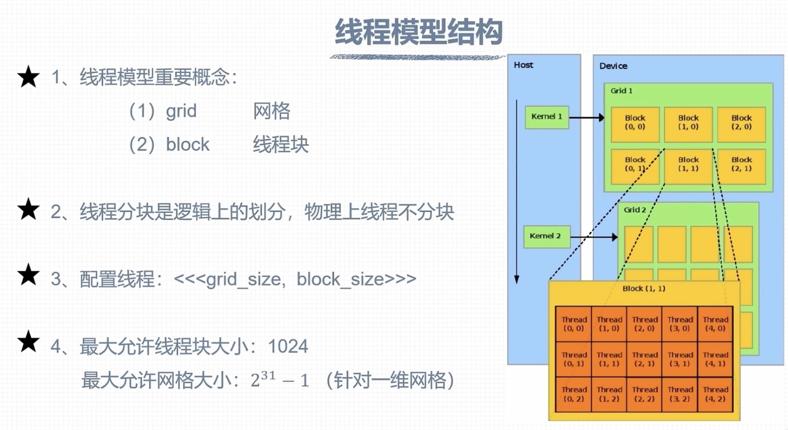

### 推广到多维
        1、cuda可以组织三维网格和线程块
        2、blockIdx和threadIdx是类型为uint32的变量，该类型是一个结构体，
        具有x,y,z三个成员(3个成员都是无符号类型的成员)：
                blockIdx.x,  blockIdx.y,  blockIdx.z
                threadIdx.x, threadIdx.y, threadIdx.z
        3、gridDim和blockDim是类型为dim3的变量，该类型是一个结构体，具有xyz三个成员：
                gridDim.x,  graiDim.y,  gridDim.z
                blockDim.x, blockDim.y, blockDim.z
        4、取值范围：
                blockIdx.x: [0, gridDim.x - 1]
                blockIdx.y: [0, gridDim.y - 1]
                blockIdx.z: [0, gridDim.z - 1]

                threadIdx.x: [0, blockDim.x - 1]
                threadIdx.x: [0, blockDim.y - 1]
                threadIdx.x: [0, blockDim.z - 1]
        注意内建变量只有在核函数有效，且无需定义 

        定义多维网络和线程块(c++构造函数语法)
                dim3 grid_size(Gx, Gy, Gz)
                dim3 block_size(Bx, By, Bz)
        举例：定义一个2x2x1的网络，5x3x1的线程块
                dim grid_size(2, 2) // 等价于 dim3 grid_size(2, 2, 1)
                dim block_size(5, 3) // 等价于 dim3 block_size(5, 3, 1)

        多维线程块中线程索引
                int tid = threadIdx.z * blockDim.x * blockDim.y +         threadIdx.y * blockDim.x + threadIdx.x
        多维网络中的线程块索引
        int bid = blockIdx.z * gridDim.x * gridDim.y +
                  blockIdx.y * gridDim.x + blockIdx.x

        网格大小限制：
                gridDim.x最大值 2^31 - 1
                gridDim.y最大值 2^16 - 1
                gridDim.y最大值 2^16 - 1
        线程大小限制：
                blockDim.x最大值 1024
                blockDim.y最大值 1024
                blockDim.z最大值 64

# 线程全局索引计算方式
## 一维网格 一维线程块
        定义grid和bloack尺寸
                dim3 grid_size(4)
                dim3 block_size(8)
        调用核函数：
                kernel_func<<<gride_size, block_size>>>(...)
        具体的线程索引方式如图所示，blockIdx.x从0到3，threadIdx.x从0到7
        计算方式：int id = blockIdx.x * blockDim.x + threadIdx.x

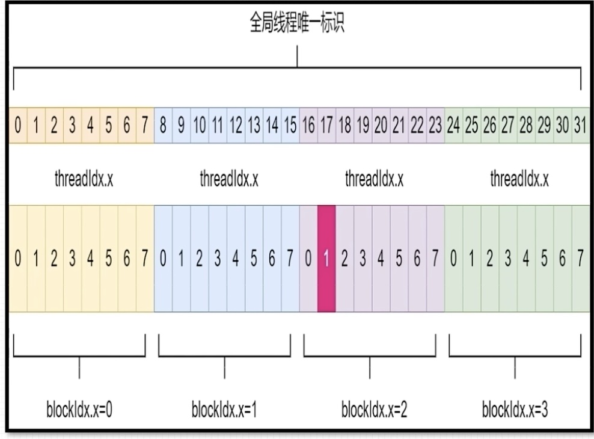

## 二维网格 二维线程块
        定义grid和block尺寸
                dim3 grid_size(2, 2)
                dim3 block_size(4, 4)
        调用核函数：
                kernel_fun<<<grid_size, block_size>>>(...)
        具体的线程索引方式如图所示，blockIdx.x和blockIdx.y从0到1，threadIdx.x和threadIdx.y从0到3
        计算方式：
                int blockId = blockIdx.x + blockIdx.y * gridDim.x;
                int threadId = threadIdx.y * blockDim + threadIdx.x;
                int id = blockId * (blockDim.x * blockDim.y) + threadId
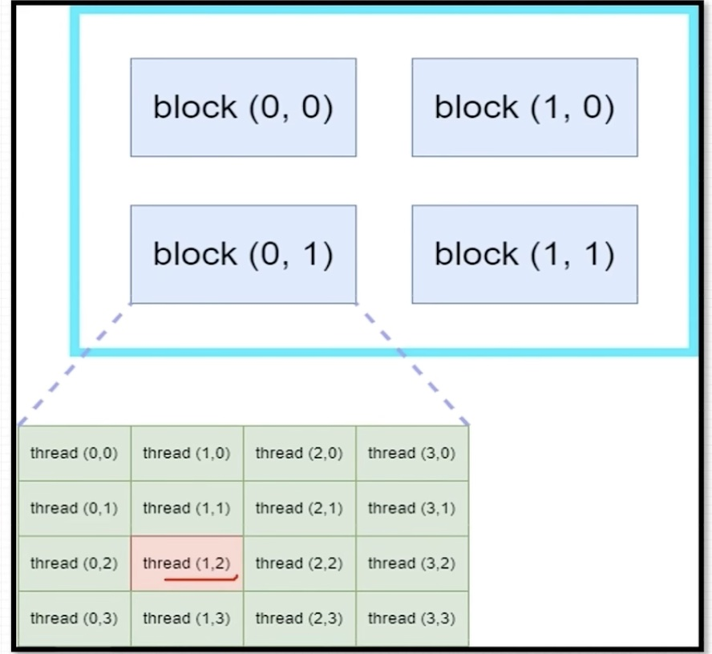

## 三维网格 三维线程块
        定义grid和block尺寸
                dim3 grid_size(2, 2, 2)
                dim3 block_size(4, 4, 2)
        调用核函数
                kernel_fun<<<grid_size, block_size>>>(...)
        具体的线程索引方式如图所示，blockIdx.x，blockIdx.y和blockIdx.z从0到1，threadIdx.x, threadIdx.y从0到3，.threadIdx.z从0到1
        计算方式：
                int blockId = blockIdx + blockIdx.y * gridDim.x + gridDim.x * gridDim.y * blockDim.z
                int threadId = (threadIdx.z * (blockDim.x * blockDim.y)) + (threadIdx.y * blockDim.x) + theadIdx.x
                int id = blockId * (blockDimx * blockDimy * blockDim.z) + threadId
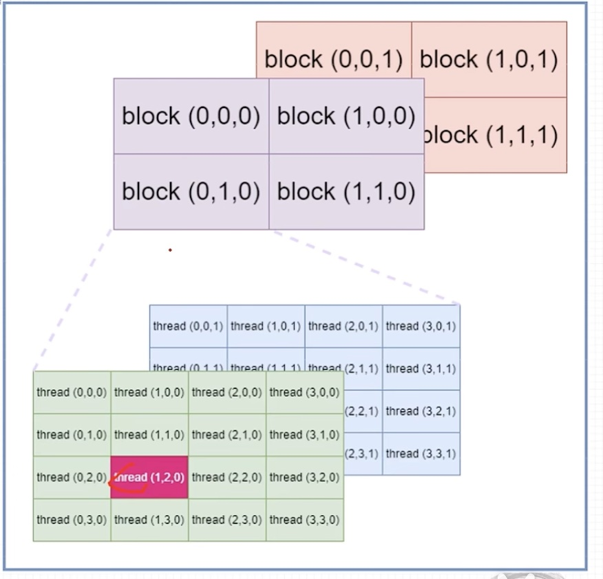

## 不同组合方式
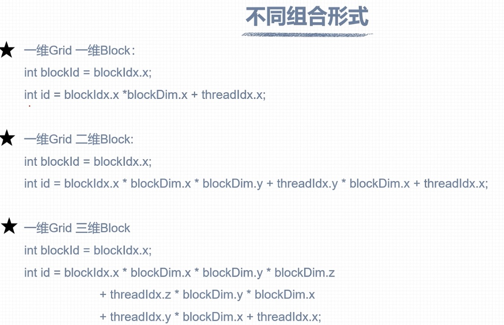
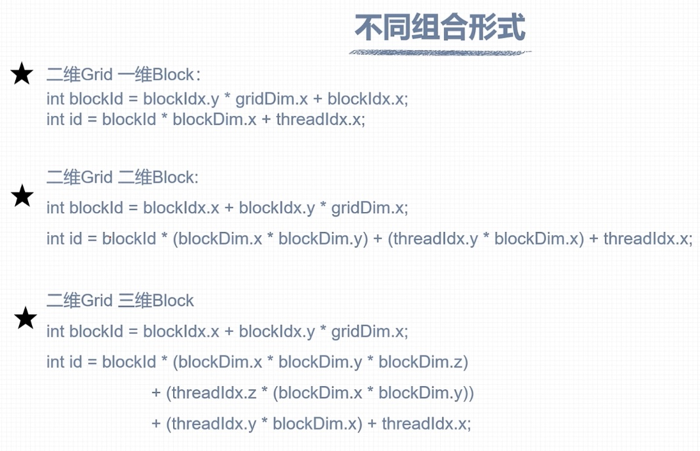

# nvcc编译流程和gpu计算能力
## nvcc编译流程
        https://docs.nvidia.com/cuda/cuda-compiler-driver-nvcc/index.html
        1、nvcc分离全部源代码：1、主机代码；2、设备代码
        2、主机(host)代码是c/c++语法、设备(device)代码是c/c++扩展语言编写
        3、nvcc先将设备代码编译为PTX(Parallel Thread Execution)伪汇编代码，再将PTX代码编译为二进制的cubin目标代码
        4、在将源代码编译为PTX代码时，需要用选项-arch=compute_XY指定一个虚拟框架的计算能力，用以确定代码中能够使用的CUDA功能
        5、在将PTX代码编译为cubin代码时，需要用选项-code=sm_ZW指定一个真实框架的计算能力，用以确定可执行文件能够使用的GPU
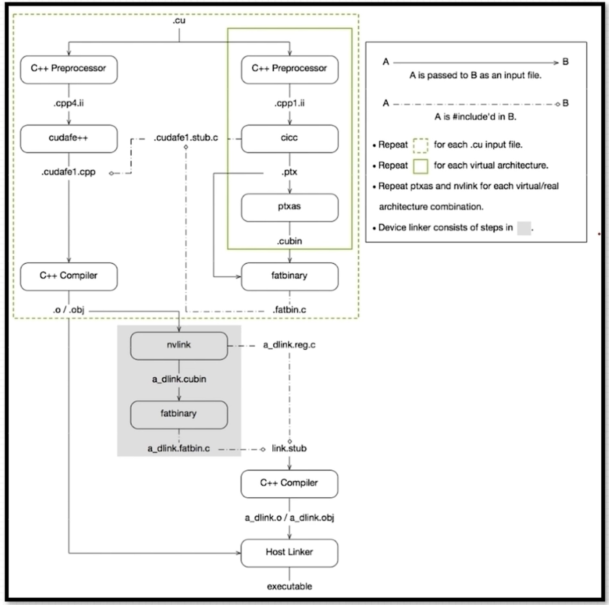
## PTX
        1、PTX(Parallel Thread Execution)是cuda平台为基于gpu的通用计算而定义的虚拟机和指令集
        2、nvcc编译命令总是使用两个体系结构：一是虚拟的中间体系结构；二是实际的gpu体系结构
        3、虚拟架构更像是对应用所需的gpu功能的声明
        4、虚拟架构应该尽可能选择低--适配更多gpu，真实框架应该尽可能选择高--充分发挥gpu性能
        5、PTX文档：https://docs.nvidia.com/cuda/parallel-thread-execution/index.html
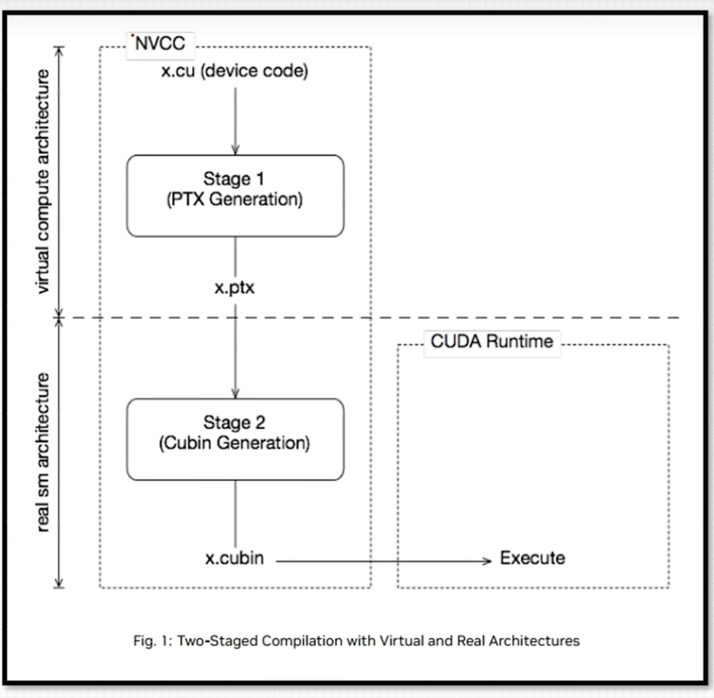
## gpu计算能力
        1、每款gpu都有用于标识“计算能力”(compute capability)的版本号
        2、形式X，Y。X:标识主版本号，Y:标识次版本号
        3、并非GPU的计算能力越高，性能就越高
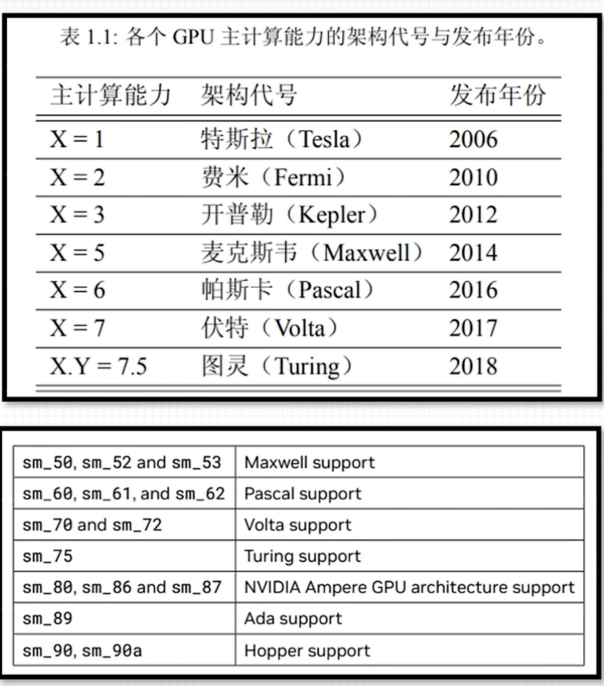
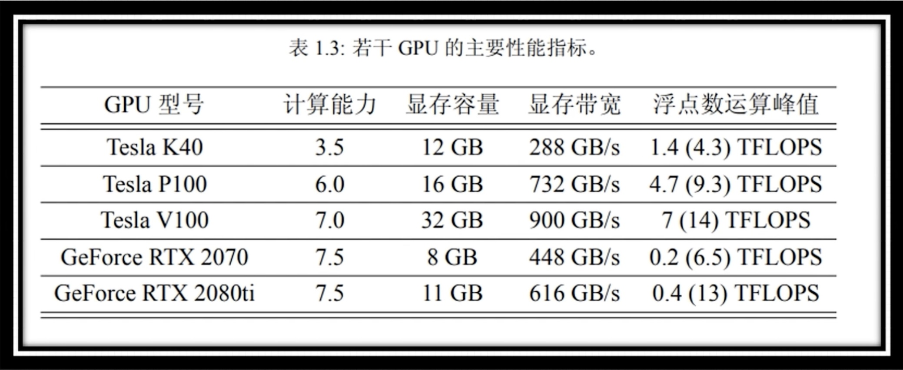

# cuda程序兼容性问题
## 指定虚拟架构计算能力
        1、c/c++源码编译为ptx时，可以指定虚拟架构的计算能力，用来确定代码中能够使用的cuda功能
        2、c/c++源码转化为ptx这一步骤与gpu硬件无关
        3、编译指令(指定虚拟架构计算能力)：
                -arch=computer_XY
                XY：第一个数字X代表计算能力的主版本号，第二个数字Y代表计算能力的次版本号
        4、ptx的指令只能在更高的计算能力的gpu使用
        例如： nvcchelloworld.cu -o helloworld -crch=compute_61
        编译出的可执行文件helloworld可以在计算能力>=6.1的gpu上面执行，在计算能力小于6.1的gpu则不能执行
        
## 指定真实架构计算能力
        1、PTX指令转化为二进制cubin代码与具体的gpu框架有关
        2、编译指令(指定真实框架计算能力)：
                -code=sm_XY
                X: 代表计算能力的主版本号，Y: 代表计算能力的次版本号
        3、注意：
                1、二进制cubin代码，大版本之间不兼容
                2、指定真实架构计算能力的时候必须指定虚拟架构计算能力
                3、指定的真实架构能力必须大于等于虚拟架构的能力
        4、真实架构可以实现低小版本到高小版本的兼容
## 指定多个gpu版本编译
        1、使得编译出来的可执行文件可以在多个GPU中执行
        2、同时指定多组计算能力
                编译选项：-gencode arch=compute_XY -code=sm_XY
                例如：
                --gencode arch=compute_35 -code=sm_35   开普勒架构
                --gencode arch=compute_50 -code=sm_50   麦克斯韦架构
                --gencode arch=compute_60 -code=sm_60   帕斯卡架构
                --gencode arch=compute_70 -code=sm_70   伏特架构
        3、编译出的可执行文件包含4个二进制版本，生成的可执行文件称为胖二进制文件(fatbinary)
        4、注意：
                1、执行上述指令必须cuda版本支持7.0计算能力，否则会报错
                2、过多的计算能力，会增加编译时间和可执行文件大小
## nvcc即时编译
        1、在运行可执行文件时，从保留的PTX代码临时编译出cubin文件
        2、在可执行文件中保留PTX代码，nvcc变异指令执行所保留的PTX代码虚拟架构：
                指令：-gencodemarch=compute_XY， code=compute_XY
                注意：1、两个计算能力都是虚拟架构计算能力
                     2、两个虚拟架构计算能力必须一致
        3、例如：
                -gencode arch=compute_35 -code=sm_35
                -gencode arch=compute_50 -code=sm_50
                -gencode arch=compute_61 -code=sm_61
                -gencode arch=compute_61 -code=sm_61
        4、简化：-arch=sm_XY
                dengjia 
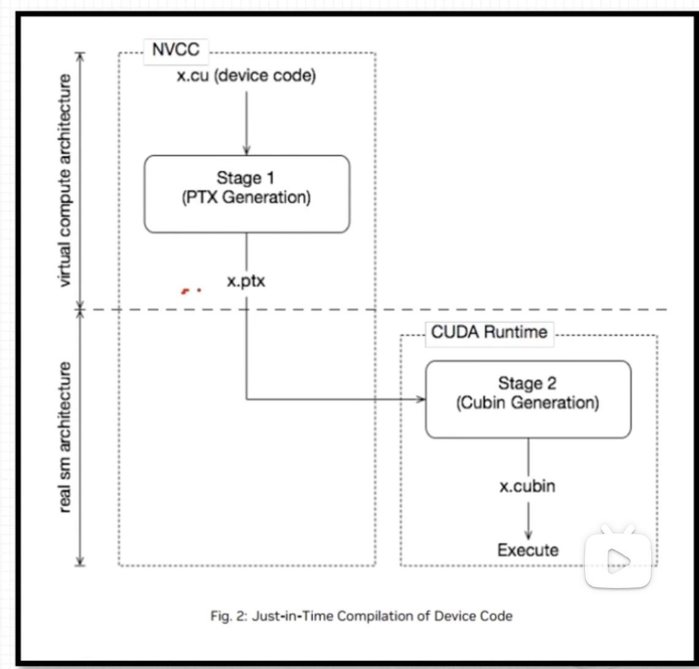
## nvcc编译默认计算能力